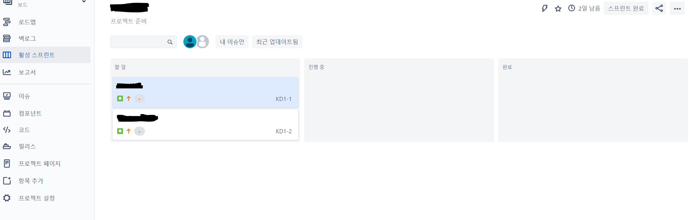
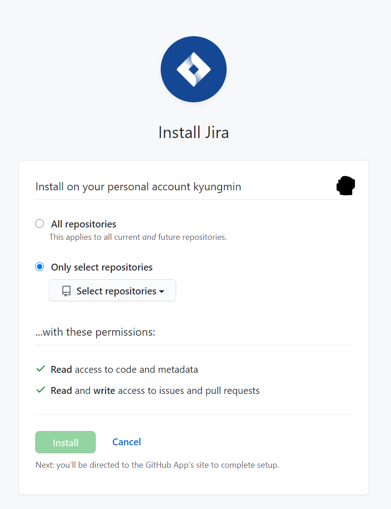

# Jira

https://www.atlassian.com/software/jira에 접속하여 로그인

## 프로젝트 생성

1. Get it free
   
2. Next
   
3. 계정과 지라에서 쓸 주소 입력
   
4. 팀원 추가
   
5. 설정
   
   - 프로젝트 템플릿 추천을 위한 과정이므로 생략 가능
6. 템플릿 선택
   
   - 나는 스크럼으로 선택
7. 프로젝트 설정
   

## 이슈 및 스프린트 생성

1. 백로그로 이동
   

2. 이슈(해야 할 일) 생성

3. 스프린트 생성 후 처리할 이슈 옮기기
   

4. 스프린트 시작

   - 스프린트 설정
     

   - 활성화된 스프린트 페이지

     

## 하위 작업 생성

해당 스토리와 관련된 하위 작업을 생성

1. 스토리 선택
2. 하위 작업 생성
   

## 스프린트 관리

- 스토리에서 생성한 하위 작업들을 상태(해야 할 일/진행 중/완료)에 맞게 옮기면 됨

# Jira - GitHub 연동

1. Jira에서 앱 - 새 앱 찾기
   
2. GitHub for Jira 선택
   
3. Get App - Get it now - Get Started - Add an Organization
4. Github 계정 정보 입력
   
5. Authorize Jira - Install Jira
   
   - 레포지토리 선택 후 Install

# 참고 :books:

- 지라 시작하기
  https://engineering-skcc.github.io/devops-tools/Jirasetting/
- 지라-깃허브 연동 (스마트커밋)
  https://sujinnaljin.medium.com/jira-jira%EC%99%80-github-%EC%97%B0%EB%8F%99%ED%95%98%EA%B8%B0-6e649180dfae

