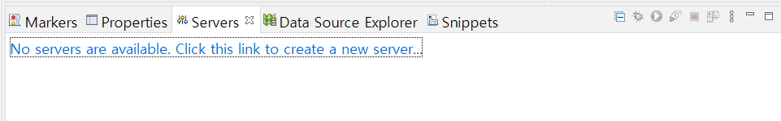
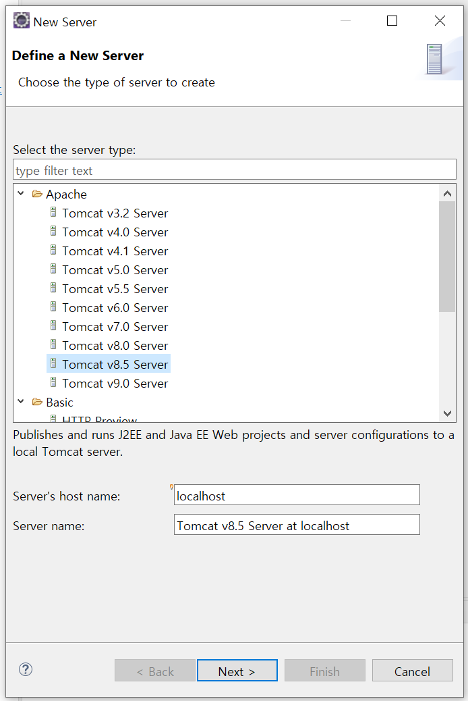
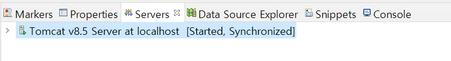
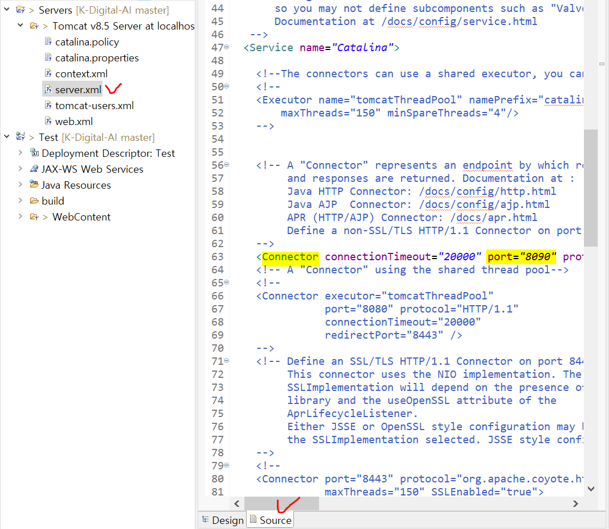
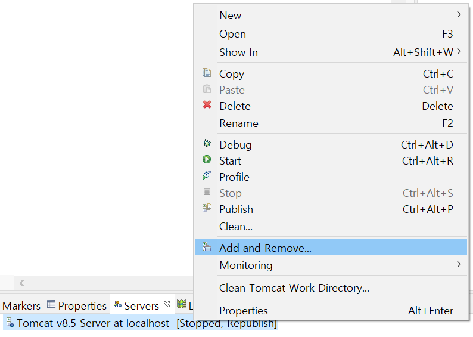
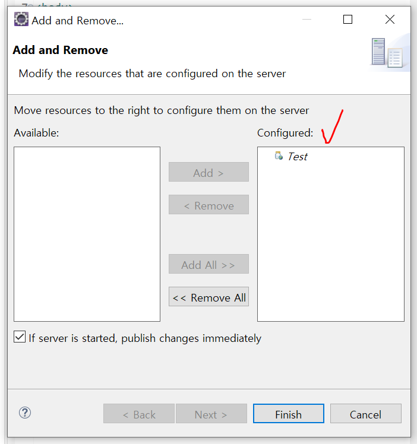
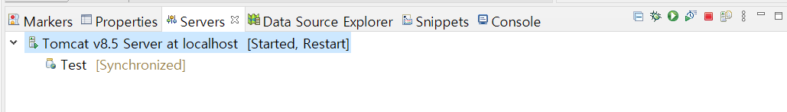

# 웹 서버 연결

- 서버

  - 공통된 서버의 정보를 주기 위함

  - 다수의 사용자가 접속할 수 있게 함

  - 각 서버마다 포트번호 달라야 함


## 톰캣 :cat:

### 설치

1. https://tomcat.apache.org/
2. Download - Tomcat 8 - Core: 64-bit Windows.zip 설치 및 압축 풀기
   - 경로에 한글/space가 없는 게 좋음

### 이클립스와 연결

1. Servers 탭에서 `Click this link ~` 클릭하여 서버 생성
   
2. 해당하는 서버 선택
   
   - Apache - Tomcat v8.5 Server
3. 연결 완료
   

#### :bulb: 포트 번호 바꾸기

> 다른 서버와 안 겹치도록 포트 번호 설정

0. Server 끄기 :exclamation:
1. 프로젝트의 `server.xml` 파일 열기
2. `Source` 탭에서 **Connector**(Server :x:)의 `port` 찾아서 포트 번호 바꾸기
   


### 프로젝트 추가

1. 서버 우클릭하여 `Add and Remove...`
   
2. 추가할 프로젝트를 Configured로 Add
   
3. 프로젝트 추가 완료
   
   - 초록색 재생 버튼으로 서버 실행
   - 빨간색 네모 버튼으로 서버 종료
4. 서버 실행한 후 http://localhost:`포트 번호`/`프로젝트명`/`파일명`로 접속


#### :bulb: 실행 브라우저 변경

Window - Web Browser 에서 원하는 방식 선택


---


# 자바 웹 프로그래밍

##  JSP 입문

> Java를 이용하여 동적인 웹 페이지를 만들기 위해 개발한 기술


### 서블릿(Servlet)

- 동적 웹 구현 기술
- 자바 기반
  - 객체 지향적
  - 플랫폼 독립적
- 스레드 기반의 요청 처리 방식 채택
  - 사용자가 많을수록 효율성 높아짐
- 화면 인터페이스 구현에 너무 많은 코드 필요
  - 스크립트 형태로 만들어 보완 => `JSP`(Java Server Page)

#### 동작 원리

1. 클라이언트에서 웹 서버로 요청
2. 웹 서버에서 요청된 서블릿 확인 후 컨테이너로 요청
3. 컨테이너에서 request와 response 생성 후 web.xml을 참조하여 해당 서블릿의 스레드 생성 후 service 메소드 호출
4. service 메소드에서는 요청 방식에 따라 doGet이나 doPost 메소드 호출
5. doGet이나 doPost 메소드에서 응답 생성
6. 컨테이너에서 웹 서버로 응답 리턴
7. 웹 서버에서 클라이언트로 응답 리턴


### JSP의 특징

- 강력한 이식성
- 서버 자원의 효율적인 사용
- 간편한 MVC 패턴 적용
- JSTL, 커스텀태그 등을 이용한 개발 용이성


## JSP 기본 요소

### JSP 지시어 (Directive)

> JSP 파일 내에서 JSP를 실행할 컨테이너에서 해당 페이지를 어떻게 처리할 것인가에 대한 것을 지정

#### Page 지시어 속성

```java
<%@ page ... %>
```

- language : 스크립트 요소에서 사용할 언어 설정
- extends : 상속받을 클래스 설정
- import : import할 패키지/클래스 설정
- session : HttpSession 사용 여부 설정
- buffer : JSP 페이지 출력 버퍼 크기 설정
- autoFlush : 출력 버퍼가 다 찼을 경우 처리 방법 설정
- isThreadSafe : 다중 스레드의 동시 실행 여부 설정
- Info : 페이지 설졍
- errorPage : 에러 페이지로 사용할 페이지 지정
- contentType : JSP 페이지가 생성할 문서의 타입 지정
- isErrorPage : 현재 페이지를 에러 페이지로 지정
- pageEncoding : 현재 페이지의 문자 인코딩 타입 설정

#### Include 지시어

```java
<%@ include file="XXX.jsp" %>
```

- 특정한 JSP 파일 또는 HTML 파일을 해당 JSP 페이지에 삽입할 수 있도록 하는 기능을 제공
- 여러 JSP 페이지에서 공통되는 부분이 많을 때 이러한 공통되는 부분을 따로 파일로 만들어 include 지시어로 삽입

#### Taglib 지시어

```java
<%@ taglib uri="..." prefix="..." %>
```

- JSTL(JSP Standard Tag Library)이나 커스텀 태그 등 태그 라이브러리를 JSP에서 사용할 때 접두사를 지정하기 위해 사용


### JSP 스크립트 요소

> JSP 페이지 내에 자바의 코드를 삽입하기 위해 사용

#### 선언문 (Declarations)

```java
<%! ... %>
```

#### 스크립틀릿 (Scriptlets)

```java
<% 문장1; %>
<%
    문장2; 문장3; 문장4; ...
%>
```

#### 표현식 (Expressions)

```java
<%=변수 %>
<%=리턴값이 있는 메소드 %>
```


## 내장 객체와 액션 태그

### 내장 객체

> 웹 컨테이너가 제공하는 고정된 이름의 객체

공통적으로 요구되는 javax.servlet 패키지 아래 8개의 객체와 예외 처리를 위한 java.lang 패키지 아래 1개의 객체를 각각 JSP 스펙에서 정해진 이름의 객체로 제공

- request : 클라이언트의 HTTP 요청 정보 (HTTP 헤더 정보, 파라미터 등)
- response : HTTP 요청에 대한 응답 정보
- session : 클라이언트의 세션 정보
- pageContext : 페이지 실행에 필요한 컨텍스트 정보 저장
- out : 응답 페이지 전송을 위한 출력 스트림
- application : 동일한 어플리케이션의 컨텍스트 정보 저장
- config : 해당 페이지의 서블릿 설정 정보(초기화 정보) 저장
- page : 해당 페이지 서블릿 객체(인스턴스)
- exception : 예외 처리