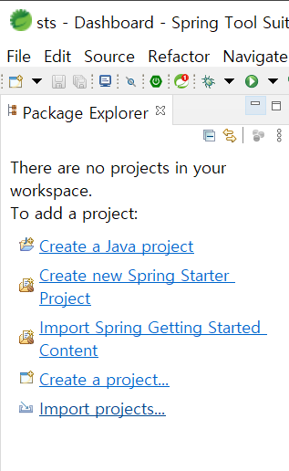
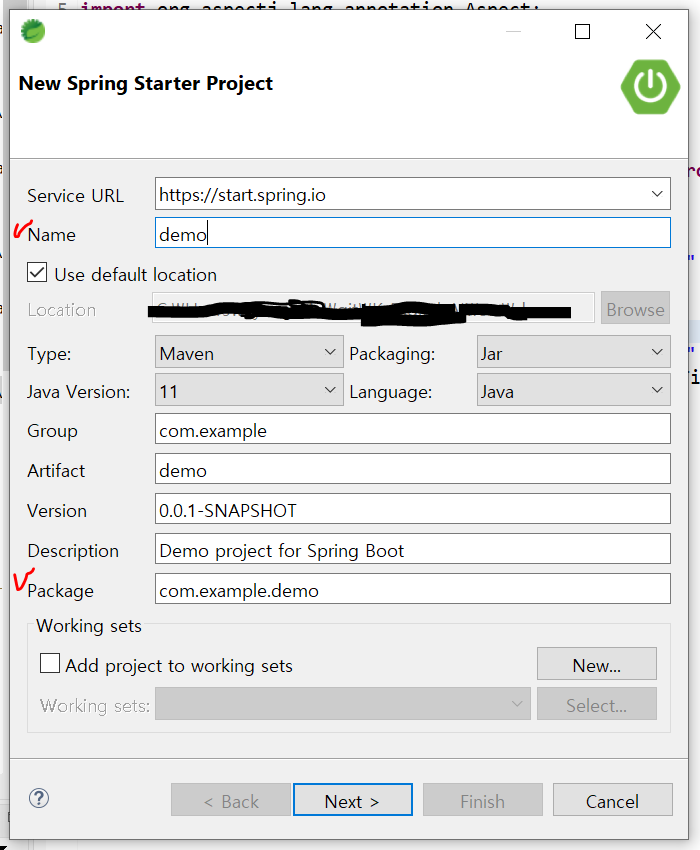

# 스프링 프레임워크 시작하기

## 스프링 설치

1. https://spring.io/tools
2. 압축 해제
   - 알집으로 하면 안 돼서 반디집으로 압축 해제함 :fried_egg:
3. Help - Eclipse Marketplace
4. Spring Tools 3 Add-On for Spring Tools 설치


:bulb: encoding 변경 하기

1. Window - Preferences
2. encoding 검색
3. Workspace
   - Text file encoding - Other : UTF-8
   - CSS files, HTML Files, JSP Files - Encoding : UTF-8


## 스프링 특징

- 경량 컨테이너
- 제어 역행 (IoC) => 애플리케이션 간 느슨한 결합 제어
  - 서블릿이나 빈 등을 개발자가 코드에서 생성하지 않고 프레임워크가 직접 수행
- 의존성 주입 기능
  - 클래스 객체를 개발자가 코드에서 생성하지 않고 프레임워크가 생성하여 사용
- 관점 지향 프로그래밍 (AOP) => 자원 관리
  - 핵심 기능 외 부수 기능들을 분리 구현함으로써 모듈성 증가
- POJO 방식 프레임 워크


## 프로젝트 생성

1. File - New - Spring Starter Project로 프로젝트 생성
   - 스프링 처음 사용 시 **Create new Spring Starter Project**로 생성 가능
     
2.  프로젝트 설정
   
   - 프로젝트명(Name), 프로젝트에서 사용할 패키지명(Package)를 설정


# DI (Dependency Injection)

> 의존성 주입

- 의존성
  - 어떤 클래스가 자신의 임무를 다하기 위해 필요한 값(필드 값)이나 사용할 다른 클래스와의 관계 주입
  - 어떤 클래스의 인스턴스에 대해 외부로부터 `의존성`을 설정

- 스프링의 의존 관계 주입 컨테이너가 하는 역할
  - 어떤 클래스가 필요로 하는 값이나 인스턴스를 생성, 취득하고, 그 클래스의 인스턴스에 대해 설정
  - 필요한 인스턴스를 생성, 취득하는 코드를 직접 만들지 않아도 됨
  - 클래스 간 관계가 느슨한 결합이 됨 => 의존성이 약해짐
- 주입 방법
  1. 생성자를 통한 주입
  2. 설정 메소드(get/set 메소드)를 통한 주입


## 실습

- src/main/resources에 xml파일 추가한 뒤 다음 복붙

  ```xml
  <beans xmlns="http://www.springframework.org/schema/beans"
  	xmlns:xsi="http://www.w3.org/2001/XMLSchema-instance"
  	xsi:schemaLocation="http://www.springframework.org/schema/beans
  	http://www.springframework.org/schema/beans/spring-beans-3.0.xsd">
  </beans>
  ```

  - beans 안에 내용 추가

    ```xml
    <bean id="messageBean" class="패키지명.클래스명"/>
    ```
  
- 메인 함수

  ```java
  ApplicationContext ctx = new GenericXmlApplicationContext("beans1.xml");
  MessageBean bean = ctx.getBean("messageBean", MessageBean.class);
  bean.sayHello("Spring");
  ```


# AOP (Aspect Oriented Programming)

> 관점 지향 프로그래밍

- 업무 등 특정 책임이 있는 클래스 안에 본질적인 처리만 기술하고, 본질적이지 않은 처리는 밖으로 꺼냄
- Object가 원래 실행해야 하는 본질적인 처리와 그 밖의 횡단 관심사로 불리는 복수의 Object에 걸쳐 기술되는 쉬운 처리를 분리 => 모듈성을 높임

## 조인 포인트 (Joinpoint)

- 어드바이스가 실행하는 동작을 끼워넣을 수 있는 때
- 메소드가 호출될 때와 메소드가 원래 호출한 곳으로 돌아갈 때

## 어드바이스 (Advice)

- 조인 포인트에 끼워넣을 코드

## 포인트컷 (Pointcut)

- 하나 또는 복수의 조인포인트를 하나로 묶은 것


:bulb: pom.xml에 dependency 추가 한 뒤에 프로젝트에서 `Maven - Update Project`

