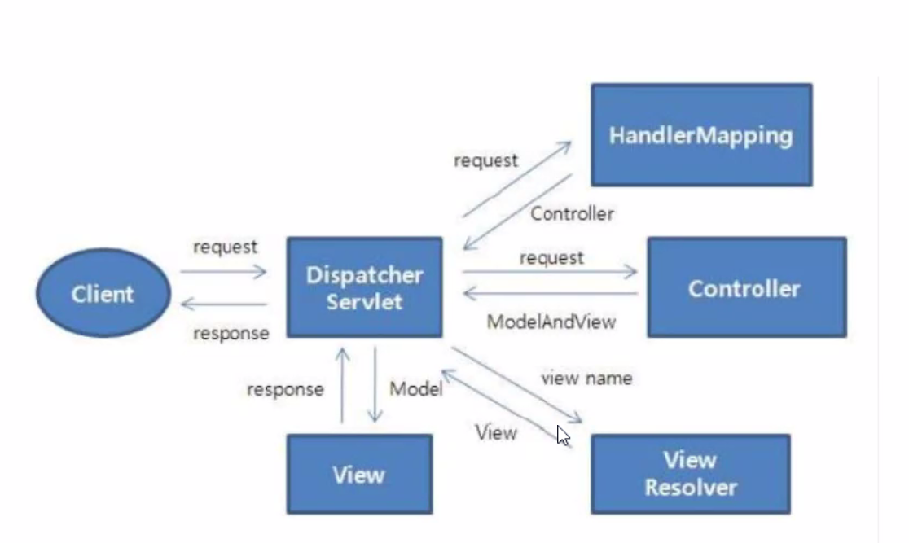
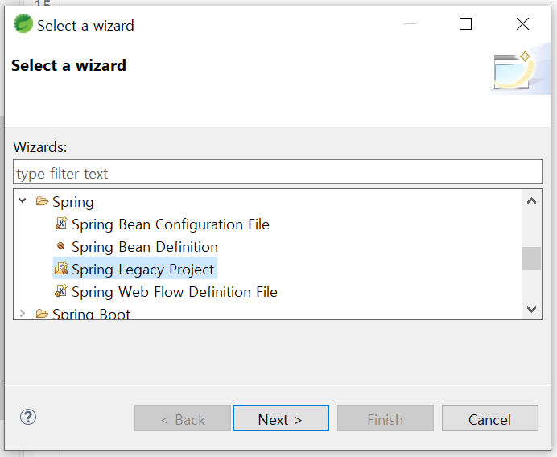
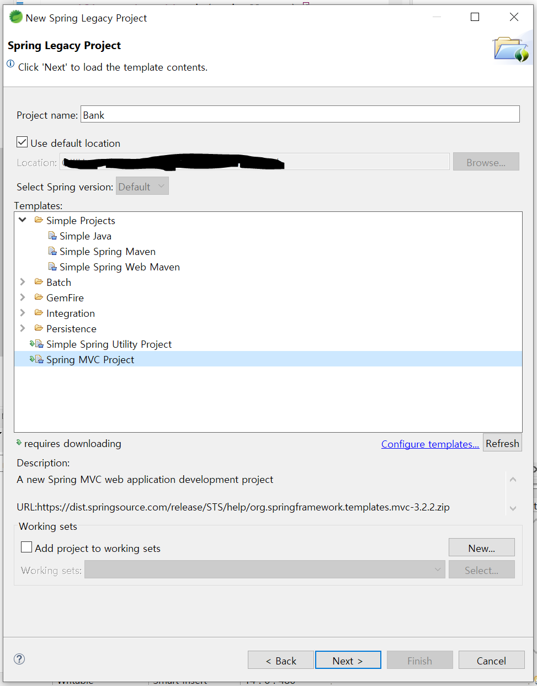
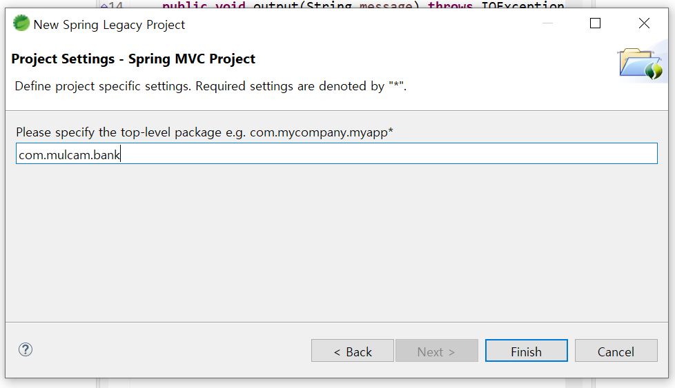
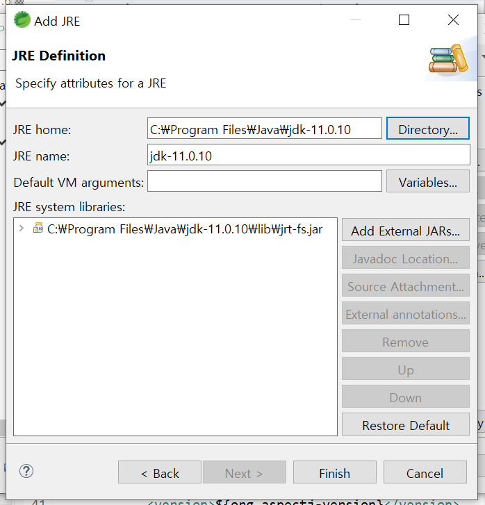
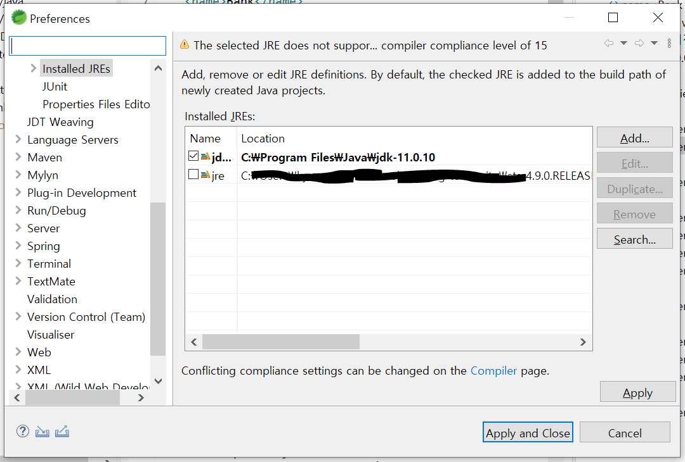

# 스프링 MVC

- 모델-뷰-컨트롤러 (Model-View-Controller)
- 비즈니스 규칙을 표현하는 도메인 1`모델`과 프레젠테이션을 표현하는 `뷰`를 확실하게 분리하기 위해서 양자간 `컨트롤러`라고 불리는 것을 배치하는 디자인 패턴
- 웹 애플리케이션에서 모델과 뷰, 컨트롤러 사이에 있는 의존 관계를 의존 관계 주입 컨테이너인 스프링이 관리
- org.springframework.web, org.springframework.web.servlet 패키지에 포함된 클래스 사용


## 스프링 MVC 처리 플로우



1. 사용자가 요청하면 Dispatcher Servlet이 받음
2. Dispatcher Servlet이, 사용할 Controller를 알려달라고 HandlerMapping에게 요청하고 받아옴
3. Dispatcher Servlet이 해당 Controller로 요청
4. Controller가 모델(데이터)와 뷰를 줌
5. Dispatcher Servlet은 View Resolver에게 해당 뷰를 받음
6. 데이터가 들어간 뷰를 사용자에게 응답


## 프로젝트 생성

1. File - New - Other : Spring Legacy Project 생성
   

2. 프로젝트 이름 설정하고 Spring MVC Project 선택

   

3. 패키지 이름 설정
   


## 프로젝트 설정

### JDK 추가

1. Window - Preferences

2. Installed JREs - Add - Directory 해서 JDK 폴더 지정
   

3. 해당 jdk 체크 후 적용

   


### JDK 적용

1. 프로젝트에서 Build Path - Configure Build Path... - Libraries
   - jdk 찾아서 적용
2. Project - Properties
   - Java Compiler : 11
   - Project Facets
     - Dynamic Web Module : 3.1
     - Java : 11


## 파일 설정

- `pom.xml`에서 자바 버전에 맞게 변경

  ```xml
  <java-version>11</java-version>
  ```

  ```xml
  <plugin>
      ...
      <configuration>
          <source>11</source>
          <target>11</target>
          ...
      </configuration>
  </plugin>
  ```

- `web.xml` 변경

  ```xml
  <web-app version="3.1" xmlns="http://xmlns.jcp.org/xml/ns/javaee"
  	xmlns:xsi="http://www.w3.org/2001/XMLSchema-instance"
  	xsi:schemaLocation="http://xmlns.jcp.org/xml/ns/javaee https://xmlns.jcp.org/xml/ns/javaee/web-app_3_1.xsd">
  ```

  - web.xml은 프로젝트 실행될 때 바로 실행됨

- root-context.xml : 서블릿들이 공통적으로 쓸 빈을 넣음

  - db 관련 부분


## 서버 설정

1. 하단에 Servers 탭이 없을 경우 Window - Show View - Servers
2. New - Server
3. Apache - Tomcat v8.5 Server
4. Tomcat 경로 설정

:bulb: Servers에서 server.xml에서 포트 번호 변경 가능

