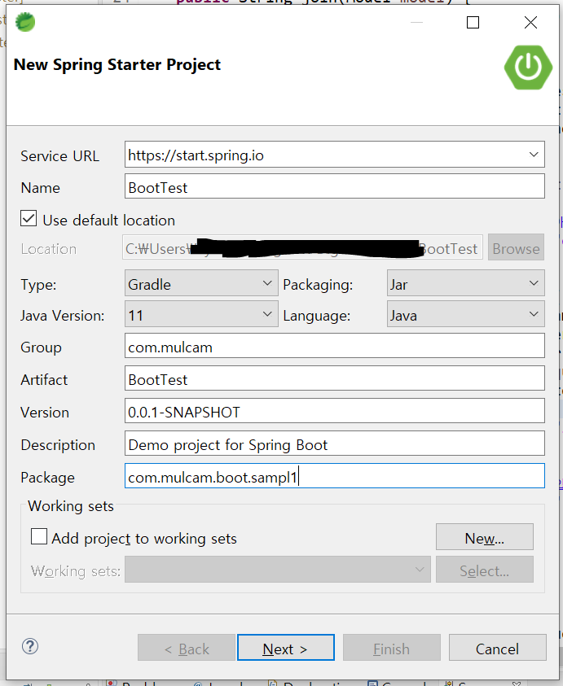
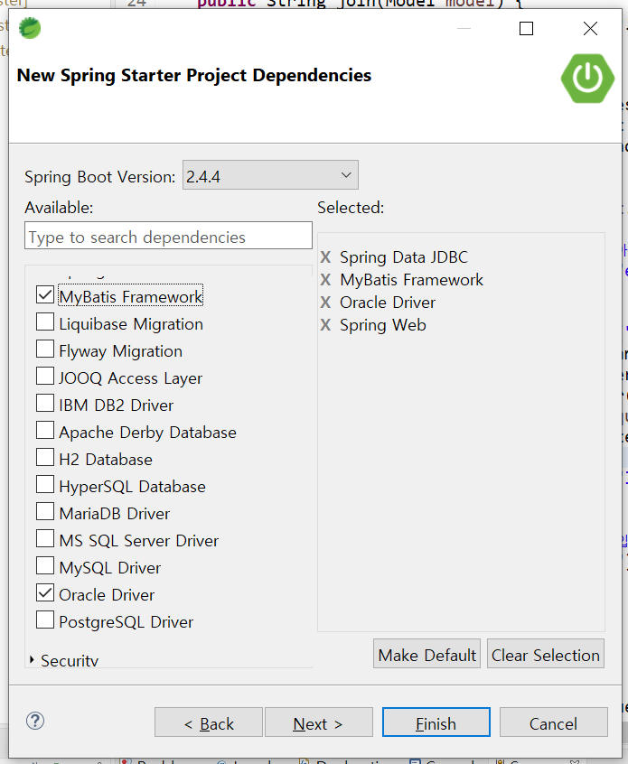

메이븐 : 라이브러리를 넣어줌


# Spring boot

## 시작하기

1. File - New - Spring Starter Project
   

   - `Gradle` 선택
   - 패키징 `War`
   - 자바 버전 선택
   - 그룹 설정
   - 패키지 설정

2. Dependency 선택

   


:bulb: 스프링 부트는 서버를 내부적으로 갖고 있어서 톰캣이 필요하지 않음


- resultMap

  - 매퍼에서 내가 쓸 필드만 사용해서 데이터 반환할 수 있음
  - 좀 더 명확히 해줌

- `@Mapper` : servlet-context에서 하던 걸 자동으로 해줌??

- `@Repository("memberDAO")` : 객체화 자동으로 시켜줌 (DB와 관련된 것?에 사용)

  => impl 만들 필요가 없음

  => 대신 DAO의 함수명과 매퍼의 id값이 같아야 함!

- DataAccessException : 매퍼의 아이디 값을 찾아가는데 그 과정에서 예외가 발생할 경우 발생함
- `@Autowired` : 객체를 자동으로 주입시켜줌 (servlet-context에서 주입시켜주던 것을 대신해줌)
- 매퍼 네임스페이스 : 인터페이스의 이름과 동일하게


### build.gradle

```
plugins {
	id 'org.springframework.boot' version '2.4.2'
	id 'io.spring.dependency-management' version '1.0.11.RELEASE'
	id 'java'
	id 'war'
}

group = 'com.mulcam'
version = '0.0.1-SNAPSHOT'
sourceCompatibility = '11'

repositories {
	mavenCentral()
}

dependencies {
	implementation 'org.springframework.boot:spring-boot-starter-data-jdbc'
	implementation 'org.springframework.boot:spring-boot-starter-web'
	implementation 'org.mybatis.spring.boot:mybatis-spring-boot-starter:2.1.4'
	
	// jsp
	implementation('org.apache.tomcat.embed:tomcat-embed-jasper')  
    implementation('javax.servlet:jstl:1.2')
    implementation('org.apache.tiles:tiles-jsp:3.0.4')
      
	implementation fileTree(dir: 'libs', include: ['*.jar'])
    implementation files('libs/ojdbc6.jar')     

	providedRuntime 'org.springframework.boot:spring-boot-starter-tomcat'
	testImplementation 'org.springframework.boot:spring-boot-starter-test'
}

test {
	useJUnitPlatform()
}

```


### application.properties

> src/main/resources

```properties
server.port=8090

spring.mvc.view.prefix:/WEB-INF/views/
spring.mvc.view.suffix:.jsp

# mybatis.config-location
mybatis.config-location=classpath:mybatis-config.xml

# Database config
spring.datasource.driver-class-name=oracle.jdbc.driver.OracleDriver
spring.datasource.url=jdbc:oracle:thin:@localhost:1521:XE
spring.datasource.username=hr
spring.datasource.password=hr

# mybatis 매퍼 파일에서 사용할 alias(memberVO)가 있는 패키지를 지정
mybatis.type-aliases-package=com.mulcam.member.vo
```


### mybatis-config.xml

> src/main/resources

```xml
<?xml version="1.0" encoding="UTF-8" ?>
<!DOCTYPE configuration
        PUBLIC "-//mybatis.org//DTD Config 3.0//EN"
        "http://mybatis.org/dtd/mybatis-3-config.dtd">
<configuration>
 <mappers>
   <mapper resource="mybatis/mappers/member.xml"/>
 </mappers>
</configuration>
```


### mappers

> src/main/resources/mybatis.mappers

mapper의 namespace는 mapper로 지정된 interface의 이름과 동일해야 함

```xml
<!-- member.xml -->

<?xml version="1.0" encoding="UTF-8" ?>
<!DOCTYPE mapper
      PUBLIC "-//mybatis.org//DTD Mapper 3.0//EN"
   "http://mybatis.org/dtd/mybatis-3-mapper.dtd">

<!-- mapper의 namespace는 mapper로 지정된 interface의 이름과 동일해야(패키지 포함) -->
<mapper namespace="com.mulcam.member.dao.MemberDAO"> 
	<resultMap id="memResult" type="memberVO">
      <result property="id" column="id" />
      <result property="pwd" column="pwd" />
      <result property="name" column="name" />
      <result property="email" column="email" />
      <result property="joinDate" column="joinDate" />
   </resultMap>
 
   <!-- <select id="selectAllMemberList" resultMap="memResult"> -->
   <select id="selectAllMemberList" resultType="memberVO">
      <![CDATA[
        select * from t_member order by joinDate desc			
      ]]>
   </select>
   <insert id="insertMember"  parameterType="memberVO">
		<![CDATA[
		 insert into t_member(id,pwd, name, email)
		 values(#{id}, #{pwd}, #{name}, #{email})
		]]>      
	</insert>
   <update id="updateMember"  parameterType="memberVO">
     <![CDATA[
	     update t_member
	     set pwd=#{pwd}, name=#{name}, email=#{email}
	     where
	     id=#{id}
      ]]>      
   </update> 
   <delete id="deleteMember"  parameterType="String">
	<![CDATA[
	   delete from  t_member
	   where
	   id=#{id}
	]]>      
  </delete>
  <select id="loginById"  resultType="memberVO"   parameterType="memberVO" >
	<![CDATA[
		select * from t_member	
		where id=#{id} and pwd=#{pwd}		
	]]>
  </select>
</mapper>
```

